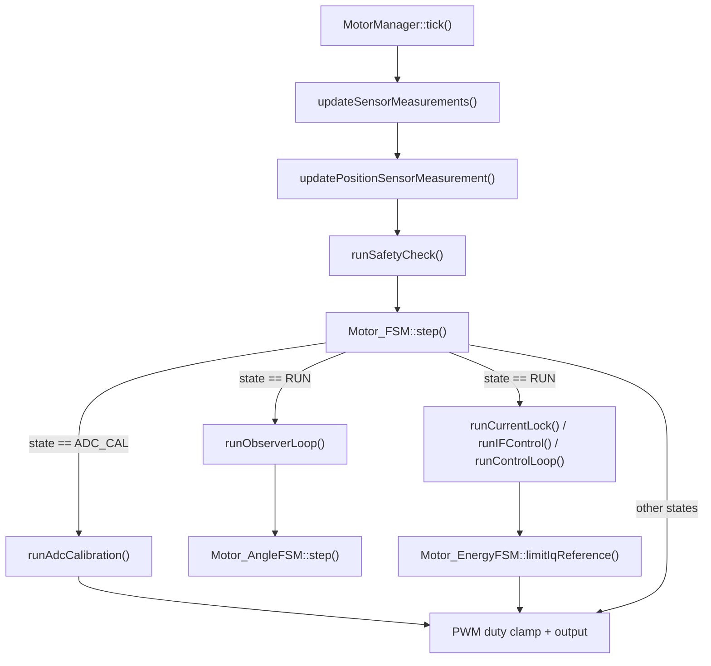
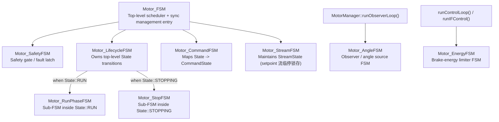
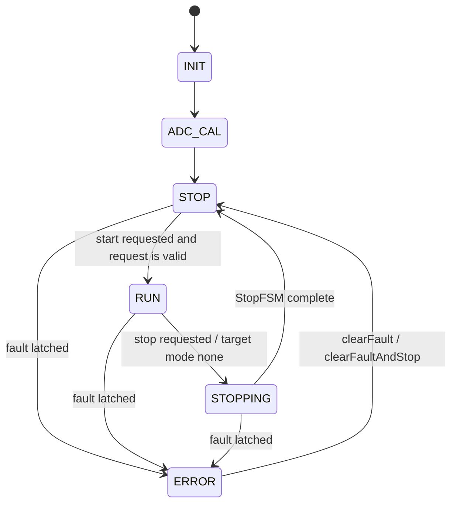
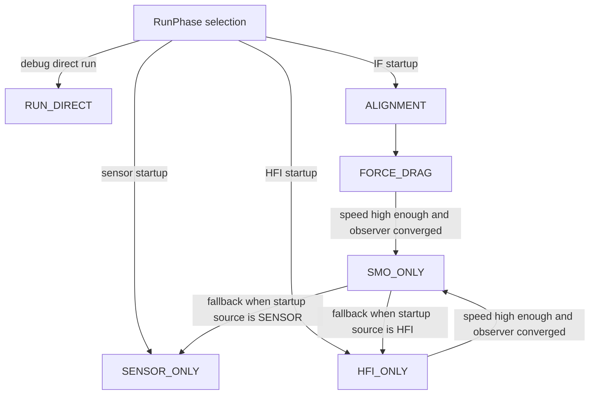

# Motor FSM Architecture

This document separates three concepts that are easy to mix together in the current codebase:

- `Motor_FSM`: the top-level scheduler plus a few synchronous management entry points
- `State`: the top-level lifecycle state enum
- sub-FSMs such as `RunPhaseFSM`, `StopFSM`, `AngleFSM`, `EnergyFSM`: nested or auxiliary state machines

## 1. Tick Execution Pipeline

## 2. FSM Module Hierarchy

## 3. Top-Level Lifecycle States

Notes:

- `Motor_LifecycleFSM` is the only FSM that directly switches the top-level `State`.
- `Motor_SafetyFSM` can force the machine into `State::ERROR` from most runtime states.
- `INIT`, `ADC_CAL`, and `ERROR` are treated specially by the safety latch logic.

## 4. Nested States Under RUN

## 5. State Spaces That Are Not Top-Level Lifecycle States

These enums are valid state machines, but they are not top-level `State` values:

- `SafetyState`: `CLEAR / FAULT_LATCHED / ESTOP_LATCHED`
- `CommandState`: `IDLE / START_REQUESTED / ACTIVE / STOP_REQUESTED / FAULTED`
- `StreamState`: `NONE / ACTIVE / SUSPENDED_BY_FAULT / SUSPENDED_BY_USER / HELD / FAULTED_LATCHED`
- `AngleState`: `NONE / SENSOR / SMO / HFI / ...`
- `StopState`: `IDLE / COAST / ELECTRICAL_BRAKE / ...`
- `EnergyState`: `IDLE / DRIVE / REGEN_ACTIVE / DUMP_ACTIVE / BLOCKED`

The important distinction is:

- `State` answers: "What lifecycle stage is the motor currently in?"
- the other enums answer: "What is the status of one subsystem while the motor is in that lifecycle stage?"

## 6. Setpoint Channel (Stream Model)

The lib no longer carries a "task" concept or a command queue.
All motion targets enter through a single streaming entry point:

- `writeSetpoint(const MotionSetpoint& sp)`
  Each control period the upper-layer coordinator calls this once.
  The setpoint overwrites the previous one; there is no completion criterion.
  Multi-axis synchronization and trajectory interpolation are handled *above* the lib
  by a Coordinator that calls `writeSetpoint` on multiple MotorAPI instances under a
  shared time base.

- `setTargetXxx(...)` (torque / speed / position)
  These are syntax sugar over `writeSetpoint` — preserved for simple applications
  (fans, EV spindle) that do not need streaming. They do not go through any queue,
  do not occupy a task slot, and always overwrite.

### Stream State (replaces former TaskState)

The `StreamState` enum describes how the setpoint stream is latched under exceptions,
so the upper layer can query after a fault whether the stream was frozen:

- `NONE`                — no setpoint ever written
- `ACTIVE`              — upper layer is streaming every tick
- `SUSPENDED_BY_FAULT`  — fault interrupted, last reference frozen
- `SUSPENDED_BY_USER`   — `stop()` / `emergencyStop()` froze the stream
- `HELD`                — upper layer stopped feeding, lib holds last position (Phase 2)
- `FAULTED_LATCHED`     — legacy-compatible terminal value, equivalent to `SUSPENDED_BY_FAULT`

### What is intentionally absent

- Task kind/type (`SetSpeed`, `SetTorque`, `SetPosition`)
- Per-task target payload with tolerance/timeout/settle-time
- Pending queue storage
- `OVERWRITE / REJECT_BUSY / QUEUE` acceptance policies
- "Completion within tolerance for N ticks" criteria
- Task result clear/ack API

All of the above belong to the upper-layer Coordinator (trajectoires, multi-axis
synchronization, completion detection). The single-axis lib only tracks one setpoint
per tick and reports stream latched-state for fault recovery.

### Impedance Mode (Phase 2/3)

`Mode::IMPEDANCE_CONTROL` and the `MotionSetpoint` fields
(`stiffness`, `damping`, `torque_bias`, `torque_limit`) are declared. Phase 2 status:

- `RuntimeCtx.imp_*` 字段已扩展并在 `writeSetpoint` 时落地 (BuildCfg IMPEDANCE 开启时)
- 控制环尚未消费: `computeIqReference` 中 IMPEDANCE 分支占位 `iq_ref=0`
- `MotorFeatureRegistry::supportsMode(IMPEDANCE_CONTROL)` 与 `CommandGuard::validateModeSelection`
  返回 true (BuildCfg 开启时) / false (默认关闭时)
- 启用本模式必须 BuildCfg 开 `MOTOR_BUILD_ENABLE_IMPEDANCE_CONTROL`, Phase 3 接通真实控制律

### Position Control (Phase 2 已接通)

- `Mode::POSITION_CONTROL` BuildCfg 默认启用 (MOTOR_BUILD_ENABLE_POSITION_CONTROL)
- `controller_.pid_position` 已建实例, `computeIqReference` 位置环链路:
    pos_err -> pid_position -> speed_ref (+ vel_ff) -> limitSpeed -> pid_speed -> iq_ref
- 速度前馈: `MotionSetpoint.vel_ff` 在 BuildCfg MOTOR_BUILD_ENABLE_VELOCITY_FEEDFORWARD 开启
  且 MotorConfig.control.feedforward.enable_vel_ff = true 时叠入位置环输出
- 力矩前馈: `MotionSetpoint.torque_ff` 字段保留, Phase 3 (BuildCfg TORQUE_FEEDFORWARD) 接通速度环叠加

### Stream Hold (Phase 2 占位)

- `StreamState::HELD` + `StreamFSM` 超时判据在 BuildCfg
  `MOTOR_BUILD_ENABLE_STREAM_HOLD_WHEN_IDLE` 开启时编译进 lib
- 超时阈值由 `MotorMotionParam.hold_timeout_ticks` 配置 (0 = 永不切 HELD)
- 流被冻结到 HELD 后 lib 不主动改 ctx_.target_pos_rad; 上层恢复 writeSetpoint 时即解除

### Distributed MCU Sync / FIFO Playback (Phase 3.0)

- `MOTOR_BUILD_ENABLE_SETPOINT_FIFO_PLAYBACK` 关闭时,
  `MotorAPI::appendSetpointSeg / triggerSegPlayback / abortSegPlayback` 返回 `Result::NotSupported`
- 开启后 lib 内使用固定容量本地 FIFO, `MotorManager::tick()` 每拍最多消费一个 setpoint
- FIFO/trigger 只负责本地同步回放; 协议帧、ACK、水位和主从同步策略仍在 App/Communication 层
- 调用序与形态范例见 `Templates/Coordinator/`
